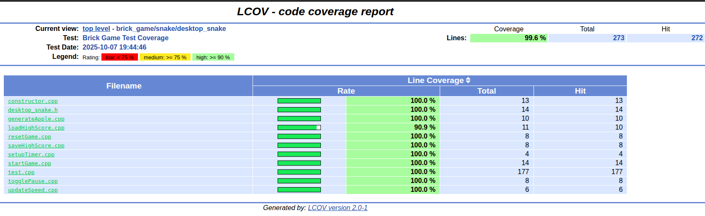
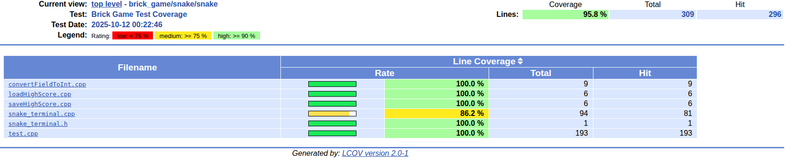
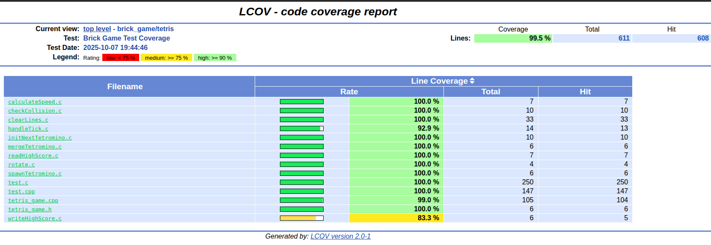
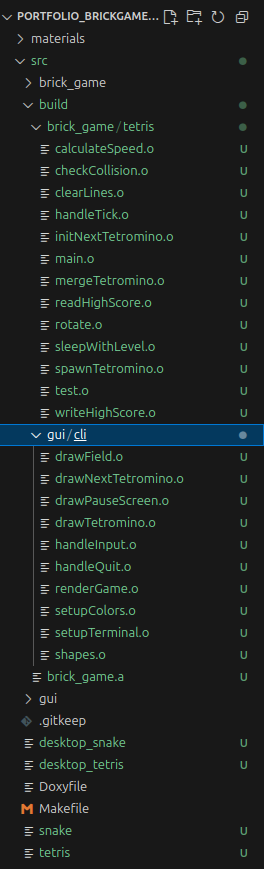
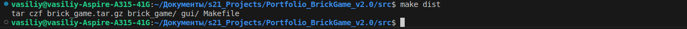
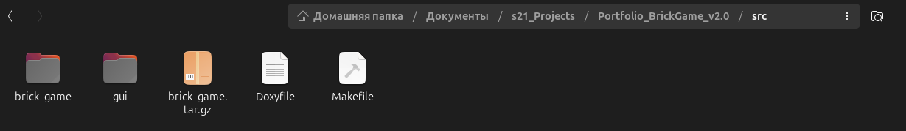
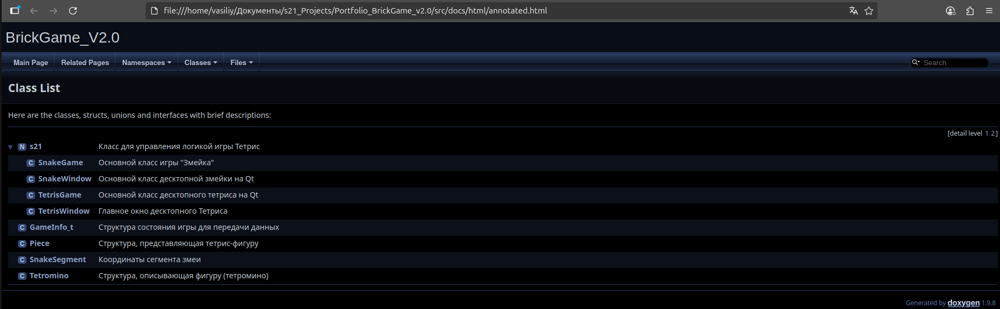

#Описание проекта CPP3_BrickGame_v2.0  
## Автор
Разработчик: [Василий Фадеев]  
Email: vasiliy.fadeev.20@gmail.com  
GitHub: [https://github.com/VasilichFadeev]  

## **Описание проекта**  
Проект написан на C и C++ для запуска на Linux. Десктопный интерфейс использует библиотеку Qt5, терминальный — ncurses.  
Реализованы две игры: тетрис, змейка. Каждую из них можно запустить с терминальным интерфейсом, так и с десктопным. Также реализованы unit-тесты для части с логикой каждого вида игры, просмотр отчёта покрытия unit-тестами с помощью lcov, сборка исходного кода в архив, doxygen-отчёт, сборка статической библиотеки.  
### Каждая из игр написана на следующих ЯП и библиотеках:  
- Терминальный тетрис — C с использованием ncurses,
- Десктопный тетрис — C++ с использованием Qt,
- Терминальная змейка — C++ с использованием ncurses,
- Десктопная змейка — C++ с использованием Qt.  
### Для сборки проекта используется **Makefile**. Он содержит следующие цели:  
- install — сборка игр,  
- uninstall — удаление игр,  
- test — запуск unit-тестов,  
- all — сборка статической библиотеки и объектных файлов,  
- clean — удаление файлов, которые остаются после выполнения целей/запуска программ,  
- gcov_report — создание html-отчёта покрытия unit-тестами,  
- dist — сборка архива с исходным кодом,  
- dvi — сборка doxygen отчёта по коду,  
- clang-format — приведение кода к google style,  
- valgrind — проверка unit-тестов на утечки памяти.  
### Структура проекта:
brick_game/  
 ├── tetris/             # Логика игры "Тетрис" (C / C++), unit-тесты для тетриса  
 ├── snake/              # Логика игры "Змейка" (C++), unit-тесты для змейки  
gui/  
 ├── cli/                # Терминальный интерфейс (ncurses)  
 └── desktop/            # Десктопный интерфейс (Qt)  
Makefile                 # Файл сборки  
### Установка и запуск:
#### Сборка всех версий игр
- make install

#### Запуск терминальных версий
- ./tetris
- ./snake

#### Запуск десктопных версий
- ./desktop_tetris
- ./desktop_snake

#### Генерация отчёта покрытия unit-тестами
- make gcov_report

#### Удаление собранных файлов
- make clean

## **Наглядные примеры работы проекта**  
### Десктопная змейка:   

  

### Десктопный тетрис:  

  

### Терминальная змейка:  

  

### Терминальный тетрис:  

  

### Тесты:  

  

### Покрытие unit-тестами:  
#### Декстопная змейка:  

  

#### Терминальная змейка:  

  

#### Тетрис (вся логика обеих версий в одной директории):  

  

### Сборка статической библиотеки:  

  

### Сборка архива с исходным кодом:  

  

  

### Doxygen-отчёт:  

  

